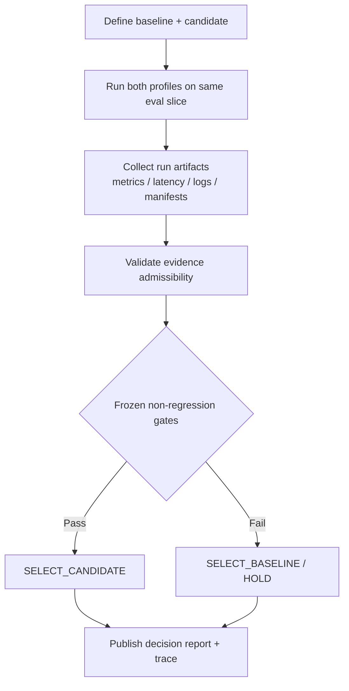

<div align="center">

# ARAG Governance Playbook
### Evidence-first model selection workflow for Agentic RAG systems

[](./LICENSE)
[](./governance/evaluation-inputs/)
[](./ARAG_CANDID_SELECTION_EVALUATION_REPORT.md)

</div>

---

## Why this repository exists

Most LLM teams can run evaluations. Fewer can **defend a promotion decision** when quality, latency, and cost disagree.

This repository exists to solve that exact problem:

- turn model selection into a **governed decision process**, not a vibe check,
- require **admissible evidence** before deciding,
- preserve a full **audit trail** from raw run outputs to final verdict.

In short: this is a practical playbook for deciding whether a candidate model should replace a baseline in an Agentic RAG stack.

---

## Quick context: what is RAG, and why does governance matter?

### What is RAG?
**RAG (Retrieval-Augmented Generation)** is an LLM workflow where the model answers using retrieved external knowledge (documents/chunks/indexes), not only its internal weights.

### What is Agentic RAG (A-RAG)?
In agentic setups, the model performs iterative tool use (search, read, reason, re-query) to gather evidence before answering.

### Why governance is needed
In production, model upgrades are risky:
- A candidate may be cheaper but slower.
- A candidate may be faster but less accurate.
- A candidate may look good on averages but fail on tail latency or sensitive subsets.

Without governance, teams accidentally ship regressions.

This playbook enforces deterministic gates so “better” means **better where it counts**, not just one metric.

---

## What this workflow is designed to do

This project operationalizes a baseline-vs-candidate decision protocol that is:

1. **Artifact-driven** — every claim maps to a stored artifact.
2. **Deterministic** — frozen gate logic defines pass/fail outcomes.
3. **Auditable** — decision chain is inspectable after the run.
4. **Reproducibility-oriented** — manifests and structured folders reduce ambiguity.

---

## Decision model (at a glance)



---

## Repository outcome in this published run

- **Decision:** `HOLD`
- **Selected profile:** `gpt-5-mini-control` (baseline retained)
- **Candidate evaluated:** `openai-codex/gpt-5.3-codex`
- **Reason:** candidate improved cost but regressed on quality and latency under frozen non-regression gates.

See canonical report: [`ARAG_CANDID_SELECTION_EVALUATION_REPORT.md`](./ARAG_CANDID_SELECTION_EVALUATION_REPORT.md)

---

## Terminology cheat sheet

| Term | Meaning in this repo | Why it matters |
|---|---|---|
| Baseline | Current production-safe model/profile | Reference point for non-regression |
| Candidate | Proposed replacement model/profile | Must beat or match baseline gates |
| Gate | Explicit pass/fail rule set | Prevents ad-hoc decision drift |
| Non-regression | “Do not get worse” on critical metrics | Protects reliability and user trust |
| Admissible evidence | Artifacts that meet completeness/authority criteria | Blocks decisions from partial data |
| HOLD | Do not promote candidate this run | Safe default under failure/uncertainty |
| Traceability | Path from claim → artifact → verdict | Enables audits and reproducibility |

---

## Why this workflow is useful beyond this repo

### Typical failure mode (without governance)
- Teams compare one metric snapshot.
- Candidate looks cheaper.
- Candidate is promoted.
- Real users later observe slower responses or worse answer quality.

### Controlled path (with governance)
- Same eval scope for both profiles.
- Frozen gates for quality + latency (+ stability checks).
- Promotion blocked unless required conditions are satisfied.

This is the difference between **experimental confidence** and **operational confidence**.

---

## Comparison: ad-hoc eval vs governed eval

| Dimension | Ad-hoc Evaluation | Governed Workflow (this repo) |
|---|---|---|
| Decision basis | Human interpretation | Frozen gate policy |
| Evidence quality checks | Inconsistent | Explicit admissibility checks |
| Auditability | Low | High (artifact chain) |
| Repeatability | Low/medium | Medium/high |
| Regression protection | Weak | Strong on defined gates |
| Team handoff clarity | Low | High (structured run package) |

---

## Artifact structure (visual map)

```text
governance/evaluation-inputs/run-20260221-212859-est/
├── 01_manifests/      # run + dataset + artifact manifests
├── 02_runs/           # baseline/candidate run outputs
├── 03_governance/     # comparison, gate, verdict materials
└── README.md          # run-local summary
```

Top-level docs:
- `ARAG_CANDID_SELECTION_EVALUATION_REPORT.md` — canonical decision report
- `ARAG_CANDID_SELECTION_EVALUATION_REPORT_GENERIC.md` — sanitized external template
- `CITATION.cff` — machine-readable citation metadata

---

## What this repository is (and is not)

### This repo is
- a **public, minimal, governance-focused snapshot**,
- suitable for researchers/practitioners studying model selection discipline,
- intentionally scoped to publish decision logic and artifacts.

### This repo is not
- a full training pipeline,
- a one-click benchmark framework,
- a claim that one model is universally best.

---

## Practical adoption guide

If you want to apply this approach in your own LLM/RAG stack:

1. Define baseline and candidate profiles.
2. Freeze your gate criteria *before* running final comparisons.
3. Enforce admissibility checks before verdict generation.
4. Version all critical artifacts and manifests.
5. Publish a concise canonical report with explicit decision rationale.

---

## Citation

If this repository or workflow informs your work, please cite the upstream A-RAG paper:

```bibtex
@article{du2026arag,
  title={A-RAG: Scaling Agentic Retrieval-Augmented Generation via Hierarchical Retrieval Interfaces},
  author={Du, Mingxuan and Xu, Benfeng and Zhu, Chiwei and Wang, Shaohan and Wang, Pengyu and Wang, Xiaorui and Mao, Zhendong},
  journal={arXiv preprint arXiv:2602.03442},
  year={2026}
}
```

See also: [`CITATION.cff`](./CITATION.cff)
