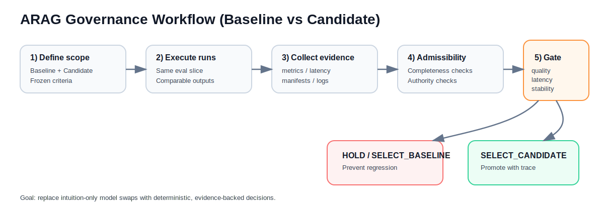
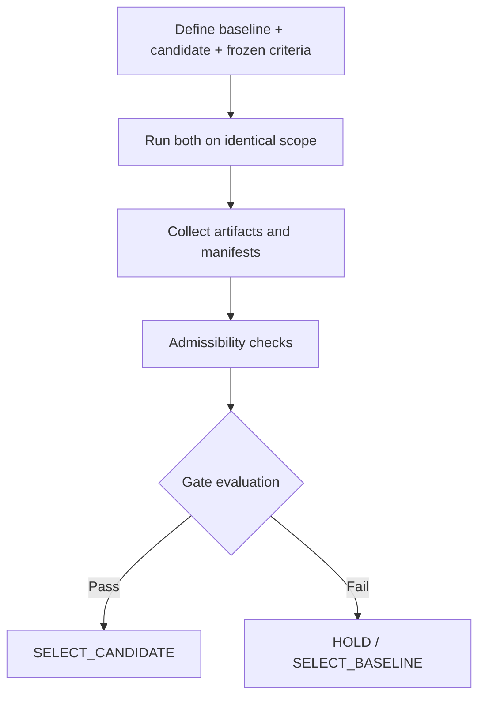

<div align="center">

# ARAG Governance Playbook
### Generic, reusable governance scaffolding for Agentic RAG model selection

[](./LICENSE)
[](https://github.com/enesdenizli/arag-governance-playbook/stargazers)
[](https://github.com/enesdenizli/arag-governance-playbook/issues)
[](https://github.com/enesdenizli/arag-governance-playbook/commits/main)

</div>

---

> [!TIP]
> ## Start here
> 1. Read this page for motivation + concepts.
> 2. Copy `governance/evaluation-inputs/` as your governance scaffold.
> 3. See `example-repo/` for a concrete filled-out run.

## Why this exists

This repo is a response to a common LLM failure mode: teams promote a new model because one metric looks better (usually cost), then discover regressions in quality, latency, or reliability after release.

The playbook here makes promotions **evidence-first** and **gate-driven**:
- baseline vs candidate must be compared on the same scope,
- evidence must be admissible,
- frozen non-regression gates determine outcome.

No hand-wavy “it seems better.”

---

## Inspiration and origin

This work is directly inspired by the A-RAG concept and implementation direction from:
- **A-RAG repository:** https://github.com/Ayanami0730/arag
- **Paper:** *A-RAG: Scaling Agentic Retrieval-Augmented Generation via Hierarchical Retrieval Interfaces* (arXiv:2602.03442)

A-RAG focuses on agentic retrieval behavior (tool use, iterative retrieval, hierarchical interfaces).  
This repository focuses on a complementary question: **how to govern model-selection decisions around those systems in production-facing workflows**.

---

## RAG and Agentic RAG (quick primer)

| Term | Meaning |
|---|---|
| RAG | Retrieval-Augmented Generation: LLM answers grounded in retrieved external knowledge (chunks/docs/indexes). |
| Agentic RAG | RAG where the model actively chooses retrieval actions iteratively (search → inspect → refine → answer). |
| Baseline | Current production-safe model/profile. |
| Candidate | New model/profile proposed for promotion. |
| Gate | Deterministic pass/fail criteria for promotion decisions. |

Why this matters: agentic systems are powerful but evaluation noise is real. Governance reduces accidental regressions.

---

## Why Qwen3-Embedding-0.6B and those datasets (in the example)

In the included example run, embeddings and datasets followed the upstream A-RAG ecosystem for comparability and practicality:

### Why **Qwen3-Embedding-0.6B**
- Strong quality/efficiency tradeoff for retrieval indexing.
- Widely available and reproducible in open workflows.
- Aligns with the upstream A-RAG setup, reducing confounders when comparing outcomes.

### Why those benchmark datasets
- Multi-hop and compositional reasoning pressure (not just single-hop lookup).
- Community-recognized RAG evaluation datasets, easier peer comparison.
- Good fit for testing retrieval + reasoning interaction under constrained budgets.

This repo does **not** hardcode these choices as mandatory. They are example defaults, not doctrine.

---

## Governance workflow (template)

<p align="center">
  
</p>



---

## Example section (reference run)

Run-specific outputs were intentionally moved under:
- `example-repo/`

That folder is a concrete demonstration of how the template looks when fully populated.

### Example outcome snapshot
| Item | Example Value |
|---|---|
| Decision | HOLD |
| Selected profile | baseline retained |
| Primary reason | candidate cost improved, but quality + latency regressed |

### Example benchmark-style comparison (format inspired by A-RAG repo)

| Method/Profile | LLM-Acc | Cont-Acc | p50 Latency (ms) | p95 Latency (ms) | Avg Cost / Query |
|---|---:|---:|---:|---:|---:|
| Baseline (`gpt-5-mini-control`) | 0.70 | 0.90 | 53,681.77 | 66,389.94 | $0.008766 |
| Candidate (`openai-codex/gpt-5.3-codex`) | 0.60 | 0.80 | 55,198.19 | 77,591.26 | $0.007227 |

> Full example artifacts + reports: `example-repo/`

---

## Repository layout (generic/template-first)

```text
.
├── governance/evaluation-inputs/        # reusable governance scaffold
├── schemas/                             # contracts/schemas for artifacts
├── runbooks/                            # operational guidance
├── example-repo/                        # concrete, run-specific example material
└── README.md
```

---

## Design goals

- **Generic:** not tied to one model provider or one dataset.
- **Auditable:** every decision maps to artifacts.
- **Portable:** easy to fork and adapt.
- **Minimal:** template-first root, examples isolated.

---

## Citation

If this repo or workflow helps your work, cite A-RAG:

```bibtex
@article{du2026arag,
  title={A-RAG: Scaling Agentic Retrieval-Augmented Generation via Hierarchical Retrieval Interfaces},
  author={Du, Mingxuan and Xu, Benfeng and Zhu, Chiwei and Wang, Shaohan and Wang, Pengyu and Wang, Xiaorui and Mao, Zhendong},
  journal={arXiv preprint arXiv:2602.03442},
  year={2026}
}
```

Machine-readable metadata: [`CITATION.cff`](./CITATION.cff)
